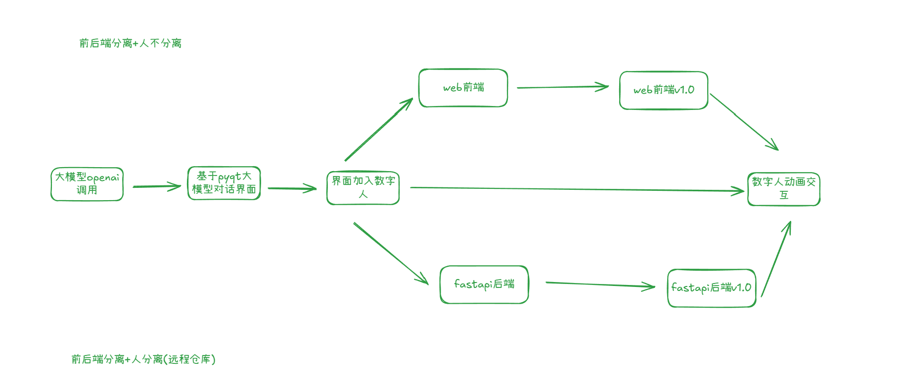
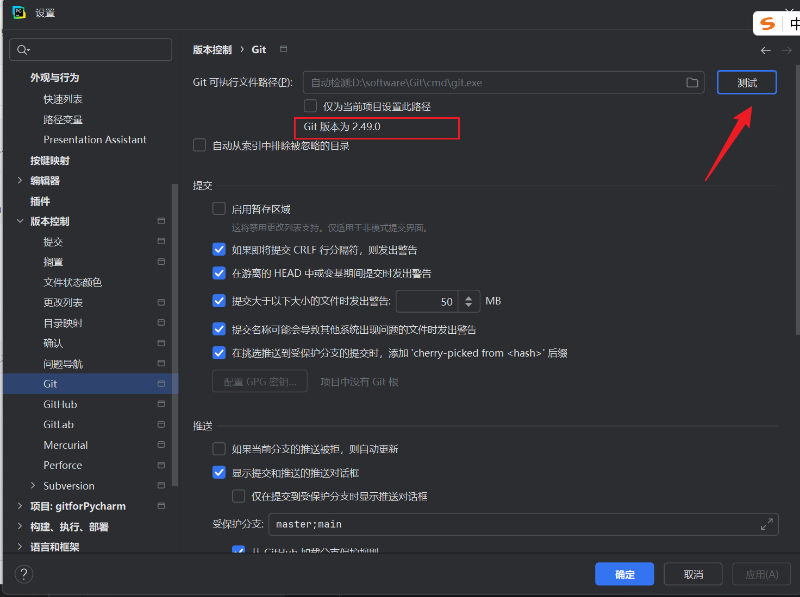
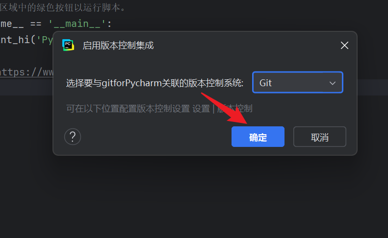
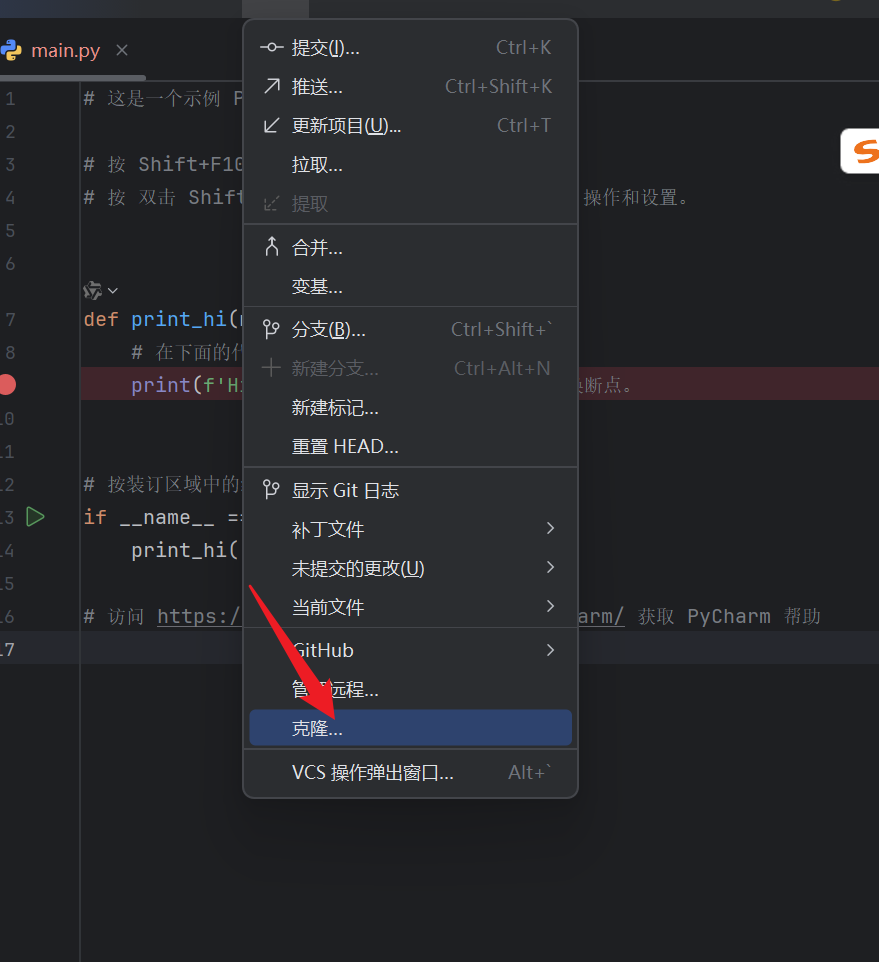
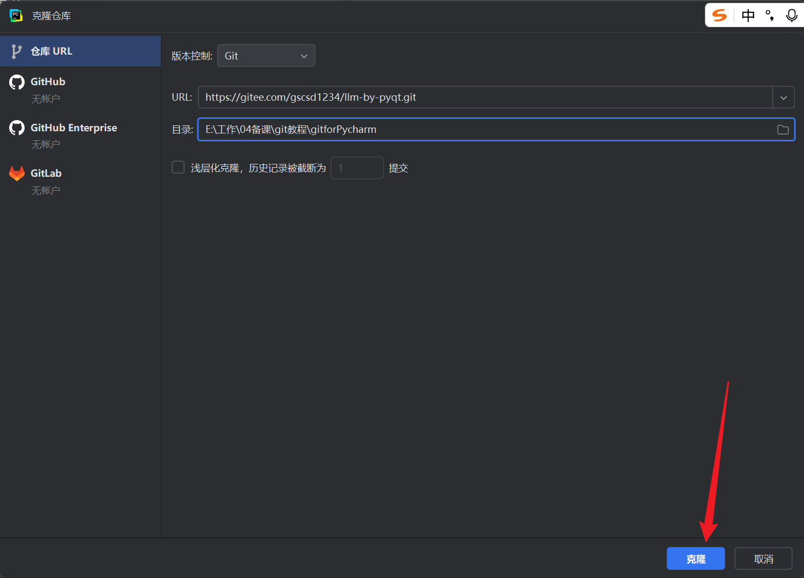

# 一、git使用方法

使用场景：工作

多人协作开发 ： 团队开发一款电商平台，不同成员负责前端、后端、数据库模块，通过 Git 分支各自开发，完成后合并到主分支。

版本迭代与历史追溯：

发现某个功能上线后导致系统崩溃，可通过 Git 查看提交记录，快速定位并回滚到稳定版本。

技术文档与知识库管理：

使用 Git 管理公司内部的开发文档，不同部门成员可同时编辑并查看修改记录。

个人项目版本管理：

个人开发博客系统时，通过 Git 分支尝试不同的功能实现方案，保留可复用的代码版本。

## 1 本地库初始化

### 1.1 git仓库初始化

```bash
git init   初始化一个空的git仓库
```

### 1.1 设置签名

描述项目创建者，联系邮箱

**项目级别/仓库级别：仅在当前本地库范围内有效**

保存位置在.git/config

```bash
git config user.name GSCSD
git config user.email 3312206566@qq.com
```

**系统用户级别：登录当前操作系统的用户范围(忽略)**

保存位置在~/.git/config

```bash
git config --global user.name tom_pro
git config --global user.email goodMorning@atguigu.com
```

级别优先级：项目优先级优先于系统用户级别

## 2 基本操作

### 2.1 状态查看

```bash
git status  
```

### 2.2 暂存区操作  (工作区 暂存区 本地库)

```bas
git add [file name] 添加到暂存区
git add . 将当前目录所有内容全部添加到暂存区
git reset [filename] 撤回某个特定文件
git reset  撤回所有暂存区文件
在这些操作之后，文件内容不会丢失，只是暂存区的更改被撤回，工作区的文件仍然保持修改状态。
```

**添加忽略文件** (忽略文件未起作用)

.gitignore

```txt
# 忽略所有的 .log 文件
*.log

# 忽略所有的临时文件
*.tmp

# 忽略编译后生成的二进制文件
*.out

# 忽略项目中的所有 node_modules 文件夹
node_modules/

# 忽略操作系统生成的临时文件
.DS_Store

# 忽略本地配置文件
*.env

# 忽略所有的压缩文件
*.zip

```

### 2.3 提交操作

```bash
git commit -m "commit message" [filename]
将暂存区的东西提交到本地库

git rebase -i ccd89e6 删除某个本地库版本  在交互里面将pick改成drop
```


### 2.4 查看版本历史

```bash
git log  基本查看
git reflog 查看引用日志
```


### 2.5 版本回退

```bash
git reset --hard [局部索引值]
```


### 2.6 比较文件

```bash
git diff [文件名]
将工作区的文件和暂存区进行比较
git diff 不加文件 比较所有文件

git diff HEAD[本地库中历史版本] apple.txt【文件名】

git diff HEAD1 HEAD2  版本文件中的比较
git diff HEAD1 HEAD2 filename 版本中指定文件的比较
```


## 3 分支管理

常用于并行开发、功能隔离和协作。



### 3.1 创建分区

```bash
git branch [分区名]

git branch Frontend  # 前端开发

Backend Server/DevOps
release/  版本分布
Debug/ 
```

### 3.2 查看分区

```bash
git branch -v  查看本地分支
git branch -a 查看本地和远程所有分支

git branch -r 查看远程分支


```

### 3.3 切换分区

```bash
git  checkout 分区名
```

### 3.4 合并分区

```bash
第一步：切换到接受修改的分支（被合并，增加新内容）上
git checkout [分支名]
第二步：执行merge命令
git merge[有新内容的分支名]
```


### 3.5 删除分区

```bash
git branch -d 分支名  安全删除（已合并到主分支的分支）
git branch -D 分支名  未合并的分支
```


## 4 创建远程仓库

### 4.1 推送操作

```BASH
git remote -v    查看是否有远程库地址

git remote add origin(远程库名  默认) https://github.com/GSCSD1/-.git  添加远程库地址
git remote add origin 移除远程库地址

git push origin master   将代码推送给远程库

# 团队成员推送
git push -u origin UI  # 执行成功之后只需要git push

```

### 4.2 拉取操作

```bash
# 针对团队成员
git fetch -p origin  # -p 表示 pruning，会清理无效的远程引用
git checkout -b UI origin/UI  # 创建本地分支UI，并基于远程分支origin/UI
# 针对创建者
git pull origin 分支名 从远程仓库获取更新并与本地分支合并。
```


### 4.3 克隆项目

```bash
git clone 远程地址
```


## 5 pycharm使用git






拉取项目






# 二、每天学习程序提交规范

参考链接： https://github.com/GSCSD1/ai-course-code/tree/master

## 1 仓库结构说明

本仓库用于存放人工智能学习过程中各阶段的程序代码，整体结构需保持清晰有序。

## 2 提交路径规范

需将每日程序存放于对应阶段的目录下，提交时切记不能**上传超过100M资源文件**（mp4，pt，images），例如 Python 语法学习阶段的代码存放于`01Python语法`目录下，并可根据知识点的结构在该目录下创建子目录（如`01Python语法/09列表/01列表的创建.py`），形成`01Python语法/[子目录（可选）]/相关知识点程序.文件后缀`的路径结构。

## 3 提交信息规范

提交代码时，Commit 信息需包含日期和核心内容，格式为`[YYYY-MM-DD] 学习内容简述`（例如：`[2024-05-20] 完成Python列表操作练习`）。

## 4 作业提交规范

需按 **学习标题_作业序号.文件后缀** 格式命名，确保一眼可识别作业对应的学习内容。

- 示例：
  - 单个作业：`文件和目录操作_作业.py`（文件和目录章节作业）；
  - 多个作业：`文件和目录操作_作业1.py`、`文件和目录操作_作业2.py`。

每次作业需要放在学习标题目录下。 

## 5 项目提交规范
参考链接：https://gitee.com/gscsd1234/QT_Shopping

readme.md: 项目演示截图  项目功能 程序架构  运行方法  